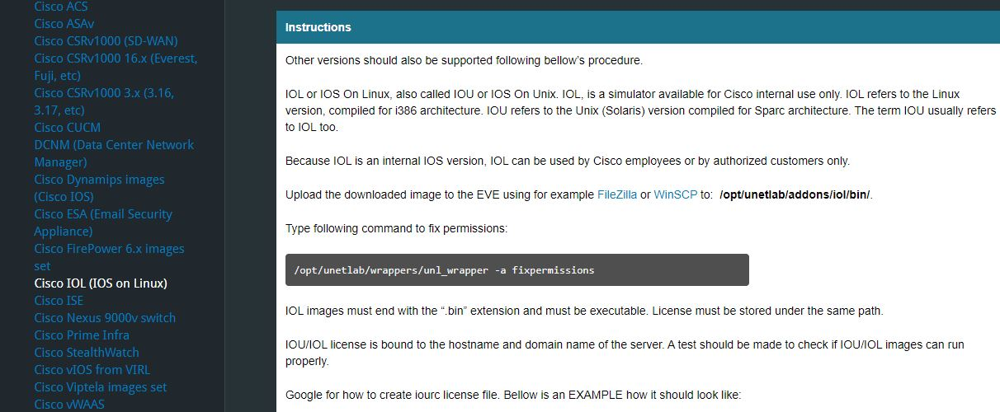
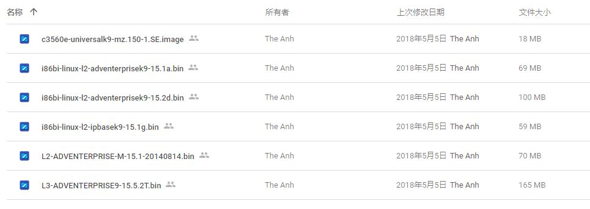

## 前言
本文主要介绍使用VMware安装EVE-NG虚拟机，同时介绍在EVE-NG虚拟机上
安装IOL、linux操作系统，以及基础使用。  
所需软件：  
1. VMware虚拟机  
2. EVE-NG community版本
3. IOL镜像
4. CiscoKeyGen.py Cisco许可证生成器
5. centos7.0操作系统镜像
## 1.EVE-NG介绍
&emsp;&emsp; EVE - The Emulated Virtual Environment For Network,Security
and DevOps 从官网的介绍可知，EVE是一个虚拟网络实验室，用户可以
在EVE上安装、运行、测试各类网络设备。EVE-NG易于安装，同时支持
Web浏览器创建Lab，对用户比较友好。
## 2.在VMware上安装过EVE-NG虚拟机
### 2.1下载EVE-NG
&emsp;&emsp;在[EVE官网](https://www.eve-ng.net/index.php/download/)
下载EVE-NG，选择免费的community版本。
 
### 2.2 VMware安装EVE虚拟机 
&emsp;&emsp;VMware导入EVE虚拟机，使用默认配置即可。内存尽可能的大，
建议内存6G以上。  
### 2.3 EVE虚拟机基本配置
&emsp;&emsp;登录EVE虚拟机。登录用户名为root，密码为eve。
首次登录时需要初始配置，使用默认配置即可。到这里EVE虚拟机的安装完成  

### 2.4 EVE虚拟机测试
首先查找虚拟机IP，IP地址在虚拟机登录界面。
如2.3节所示，博主的虚拟机地址是`192.168.0.6`。
在主机中打开浏览器，输入EVE虚拟机的IP地址，如下图。  
  
默认用户名是`admin`，密码是`eve`。选择`Html5 console`。
显示登陆成功。

## 3.安装Cisco IOU/IOL
EVE官网对于如何使用各类设备都有详细的介绍，因此首要可以查看[官网](https://www.eve-ng.net/index.php/documentation/howtos/howto-add-cisco-iol-ios-on-linux/)。

### 3.1安装IOU/IOL的原因
&emsp;&emsp;在EVE中摸拟网络设备，如路由器、交换机、主机等，都需要先
导入相关的镜像。
&emsp;&emsp;IOL/IOU是思科的摸拟仿真器，可模拟二层交换或三层路由。
IOL（IOS on Linux）是相应的linux版本，IOU（IOS on UNIX）则是对应
的UNIX版本。具体介绍可见[介绍](https://www.eve-ng.net/index.php/documentation/howtos/howto-add-cisco-iol-ios-on-linux/)。
### 3.2下载
&emsp;&emsp;可在google中搜索，或博主使用的[下载地址](https://drive.google.com/drive/folders/1qatcK8EV4ZVWk3j-G2MnUxi_cMQakKUk)，
L2指的是二层交换机，L3指的是三层路由器。

### 3.3放在指定文件夹
&emsp;&emsp;EVE所使用的镜像都需要放置在固定的文件夹中。所有的镜像放置目录为
```
/opt/unetlab/addons
```
&emsp;&emsp;在`addons`文件夹下，有三个子文件夹,
分别是dynamips,iol,qemu。  
  
三者的区别是
>QEMU是一个通用的开源机器仿真器和虚拟器。  
>Dynamips是GNS3从一开始就利用的技术，
>它使用Etherswitch模块模拟Cisco路由器和基本交换。
>它模仿旧的思科硬件，如3725路由器，并使用实际的思科IOS镜像。  
>IOL是Linux上的IOS (IOL)，也就是Unix上的IOS (IOU)。
对我们而言，只需记住Cisco的IOL文件放在IOL目录下
windows/linux等操作系统放在qemu下即可。  

&emsp;&emsp;因此需要将本节中所提及的IOL文件放置在如下目录。
```
/opt/unetlab/addons/iol/bin
```
### 3.4修复权限
&emsp;&emsp;使用eve自带的工具，在命令行中输入
```
/opt/unetlab/wrappers/unl_wrapper -a fixpermissions_
```
### 3.5生成IOL/IOU许可证
&emsp;&emsp;先下载Cisco的key生成器，google CiscoKeyGen或
使用[下载地址](https://cloud.zenandidi.com/s/DuOTCAu7ocCLVRL)。
将生成器放在
```
/opt/unetlab/addons/iol/bin/
```
运行如下命令
```
pyhton /opt/unetlab/addons/iol/bin/CiscoKeyGen.py
```
可以看到在同一个文件下， 出现了一个iourc的文件,内容如下。

## 4测试IOL
在第三节中， 我们已经按照官方教程安装了IOL设备，接下来需要测试
是否能够正常使用。
### 4.1新建实验
&emsp;&emsp;在浏览器中输入eve的ip登录，在左上角选择`add new lab`,
输入基础信息,如实验名称、作者、版本、描述信息等。
  
### 4.2添加IOL设备
&emsp;&emsp;进入实验环境后，点击左上角的加号`add new objective`，添加`Node`。
可以看到在模板中，大部分设备都是不可选的，因为我们没有添加相应的镜像，
同时也可以看到EVE-NG可以使用的设备非常多，功能很强大。我们选择`Cisco IOL`模板。  
 
### 4.3配置IOL设备
&emsp;&emsp;在image中选择相应的镜像，L3表示路由器，L2表示交换机。本文选者L2的镜像。
接着配置内存，接口,选择标识图片等。  

### 4.4进入IOL的控制台
&emsp;&emsp;右键交换机，启动。颜色变绿之后，左键双击图表，进入Html式样的控制台。
  
至此IOL部署成功。
## 5部署Linux交换机
在部署之前，**强烈推荐**去[官网](https://www.eve-ng.net/index.php/documentation/howtos/howto-create-own-linux-host-image/)
查看相应的文档。非常的详细！
  
### 5.1下载linux的镜像
官网可下。
### 5.2 创建目录
如前文IOL部署所述，操作系统的镜像需要放在
```
/opt/unetlab/addons/qemu/
```
不同的是，操作系统需要创建相应的文件夹，且文件夹有命名规则，详见官网。
```
mkdir /opt/unetlab/addons/qemu/<系统前缀><版本>
```
本文使用centos7.0操作系统。因此：
```
mkdir /opt/unetlab/addons/qemu/linux-centos7.0
```
之后，将centos7.0操作系统的ios放在此目录下。
### 5.2 修复权限
和iol的修复类似：
```
/opt/unetlab/wrappers/unl_wrapper -a fixpermissions_
```
### 5.3创建硬盘
如果直接使用官方的文件，后缀名为`.qcow2`,那么已经安装完成。
此部分针对的是使用`.ios`自己创建操作系统的用户。
创建硬盘:
```
/opt/qemu/bin/qemu-img create -f qcow2 /opt/unetlab/addons/qemu/linux-centos7.0 virtioa.qcow2 20G
```
如果不创建虚拟硬盘，在安装操作系统时会提示找不到操作系统所需要安装的位置。
如下:

### 5.4创建实验，并添加操作系统
同4.2节，不过此次选择`linux`模板。  

在配置的`image`中选择添加的操作系统，选择内存等其他配置之后便可以启动了。
启动之后，和直接在Vmware中安装Linux虚拟机类似。  
  
因为在5.3节已经创建了虚拟硬盘，因此此次安装可以看到有一个可选的硬盘。  
  
接着就等待安装完成，需要较长的时间。
### 5.5 固化QCOW2虚拟硬盘
在大多数情况下，我们会在一个实验中创建多个操作系统。如果每次都
重新安装一次操作系统，需要花费很多的时间。实际上，安装成功的
操作系统可以被复制，这样就避免了多次安装的过程。  
固化虚拟硬盘需要相关的序号`<用户名><实验序号><node编号><虚拟硬盘名称>`。
用户名主界面的`Management`中，POD号既是用户号。在实验左侧的`Lab detail`记下该实验的`UUID`。右键选择设备图表，会出现ID（如1），这就是
node编号。  
在找到虚拟硬盘的位置之后，需要将已有操作系统的虚拟硬盘替换之前在操作系统目录下创建的空硬盘。
```
/opt/qemu/bin/qemu-img convert -c -O /opt/unetlab/tmp/0/a16d0b50-b9f5-4bd9-a257-c7b0704af870/2/virtioa.qcow2  /opt/unetlab/addons/qemu/linux-centos7/virtioa.qcow2
```
稍等片刻。
### 5.6 移除ios文件
如果不移除Linux的ios文件，会默认使用ios启动，那么就会重新安装。
```
rm /opt/unetlab/addons/qemu/linux-centos7/linux-centos7.ios
```

## 6测试linux虚拟机
本节创建两个linux虚拟机，一个交换机，通过设置ip使两个虚拟机之间可以通信。
实验拓扑如下：

### 6.1设置linux的IP
centos7操作系统的网卡配置文件在目录：
```
/etc/sysconfig/network-scripts/
```
本节修改eth0的配置
```
vi /etc/sysconfig/network-scripts/ifcfg-eth0
```
在linux1的配置文件中修改`BOOTPROTO=none`,`ONBOOT = yes`，并添加
```
IPADDR=192.168.0.100
NETMASK=255.255.255.0
GATEWAY=192.168.0.9
```
linux2的文件也同样修改，ip地址设为`192.168.0.101`
### 6.2 重启linux的网络服务
配置之后需要重启才能将文件写入网卡。重启网络服务
```
service network restart
```
重启成功之后(有时候会需要重启两次，不知道为啥:| )，查看ip地址，`ip addr`结果如下：

### 6.3 交换机配置
交换机在本次实验中不需要配置
### 6.4ping实验
在linux1（ip为192.168.0.100）命令行中尝试ping linux2（ip为192.168.0.101),结果如下：
  
实验成功啦
## 7.其他问题
### 问题1：
eve异常关机之后，浏览器无法登录。输入命令：  
```
root@eve-ng:~/opt/unetlab/wrappers/unl_wrapper -a restoredb
```
之后可重用，太神奇了哇 

