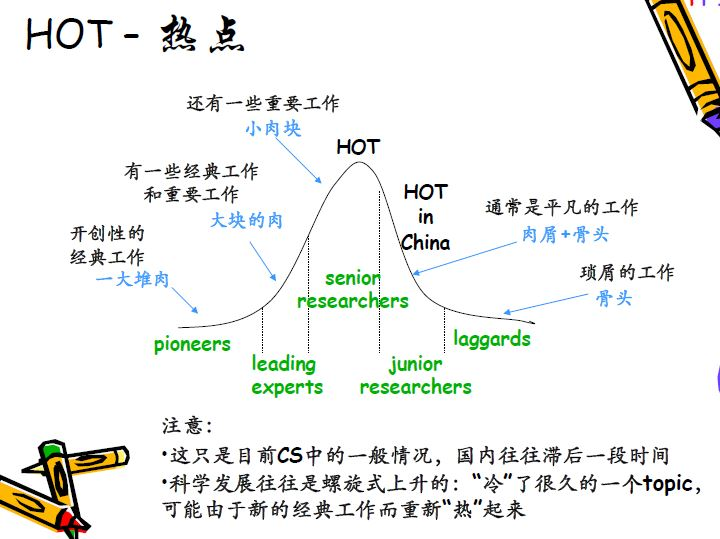

## 前言
虽然已经过了硕士的阶段，但因为某些原因不得不重新寻找研究的方向，
这个过程还是像硕士那般让人感觉到痛苦。硕士曾经花费了一年半的时间
确定研究的方向，在正式确定开题方向之前，数次改变研究发现的经历到如今
也让我心有余悸。因为开题方向确定的太晚，以至于只有一年的时间写论文。  

希望自己在博士研究生阶段可以更快的确定研究发现，投入更多的时间在
科研上面。

在正式开始之前，介绍下研究活动的基本过程。
对于一个研究生而言，研究活动的过程为：
1. 确定主题topic
2. 寻找问题problem
3. 产生想法idea
4. 具体工作，如理论分析、实验
5. 论文写作
6. 投稿

## 1.确定主题topic

研究领域基本上从选择专业、导师和实验室时，就已经确定了。比如选择一个量子通信
的实验室，那么基本上大方向就是量子通信领域。在一个领域中，其研究的主题也是很多的。

首先谈一些在选择具体的方向时，需要考虑的因素；之后再讲一下如何选择。
### 1.1需要考虑的因素
#### 1.1.1 个人兴趣

#### 1.1.2 实验条件
对于计算机领域，需要考虑 **实验数据**  来源。尽管有一些开放数据，但是如果
你选择的方向所需要的数据并非公开，比如微软、google研究人员采用的内部数据，
你无法得到，也无法复现实验。那么最好不要选择。  

同时还要考虑到实验室已有的 **成果积累**，如果实验室之前的重心是在网络方面，而你打算去
研究软件的漏洞挖掘，那么也是不合适的。  

再者是实验室的条件，能否支持所需的实验。
#### 1.1.3 自身的知识结构
尽量不要选择完全不懂的主题，那样需要学习的成本太大。并且在刚开始寻找方向时，往往会出现
调整方向的情况，那么对于某些领域的了解所需的时间成本太大。
### 1.2 如何选择topic
#### 1.2.1 导师建议
这种方式是最直接的方式，可以节省大量的时间。
#### 1.2.2 自己寻找
通常来说，都会选择热门的领域进行研究。那么怎样去确定人们领域呢？
周志华老师对于热点问题的讲述很棒，如下：  

#### 顶级会议分类
在计算机领域的顶级会议上，所有的文章都是按照一定的类别进行归档。
比如计算机安全领域的s&p，其2019年的文章分为十六个不同的主题：
1. 硬件安全
2. 区块链和加密货币
3. web安全
4. 隐私
5. 协议和认证
6. 程序分析
7. 移动端和位置安全
8. 机器学习
9. fuzzing
10. 测信道和数据泄露
11. 系统和应用安全
12. 加密和加密数据
13. 网络安全
14. 编程语言
15. web和云安全
16. loT安全

类似的，可以在不同的顶级会议寻找相关的topic。
计算机安全的四大顶会：
1. IEEE symposium on security and privacy （IEEE S&P）
2. USENIX security
3. Network and Distributed System Security Symposium （NDSS）
4. Conference on Computer and Communications Security （CCS）

#### 选择关键词-缩小兴趣
从这些大方向中，选择几篇感兴趣的文章。然后从这几篇文章中提取关键词。
#### 扩展论文
在google学术中搜索关键词，找到一些相关文章，或者将感兴趣文章的引用列出来。
最好能找到开创性的文章，作者。接着就是阅读来寻找problem。

## 2.寻找问题
科研从某种角度而言，就是问题导向。在阅读论文时最核心就是要找到
这篇文章要解决的问题，在思考科研方向时，同样要牢记，在这个方向存在
哪些问题。  
### 2.1 论文阅读
同一领域下，阅读20-30篇文章，基本就可以确定该领域存在哪些未解决的问题。

#### 三步阅读法

主要内容来源于剑桥大学教授Srinivasan Keshav的《how to read a paper》和明尼苏达大学的Peter Carr教授的《how to read a paper efficiently》。

在开始介绍之前，要强调一点，论文阅读在我看来很接近《如何阅读一本书》中提到的主题阅读，也就是说我们需要针对同一问题或相近问题，同时阅读大量不同作者的解决方法， 相互印证，促进理解的过程。所以会更希望在阅读之前先思考要解决的问题，并找到问题下的若干篇文章。带着问题去阅读。

#### 1）速览

五分钟的时间阅读题目、摘要、关键词、小标题。阅读完之后要确定：

1. 是否与主题相关
2. 解决的具体问题是什么
3. 大致基于何种理论
4. 结构是否清晰
5. 核心idea是什么

#### 2）抓重点

大约半小时阅读引言、图表、结论和讨论，简单的阅读实验部分。在阅读的过程中，要将问题标注出来，但不急于得到解答。抓住文章的整体脉络。

1. 能够向他人复述整篇文章

#### 3）重构

跟随作者的思路，重构整篇文章。将自己重构的细节与作者实现的细节对比：

1. 找到作者的创新点
2. 找到作者隐藏在实验和技术分析中的假设。
3. 思考每一个细节！

在阅读和阅读之后，非常重要的内容是写笔记，写笔记可以帮助理清自己要解决的问题，同时也可以复现整个文章。

### 2.2关注同行
通过第一阶段的论文阅读，要把握住该领域的领导研究者。重点关注他们的研究方向。
同时也可以去他们的主页、相关实验室“淘淘金”。

