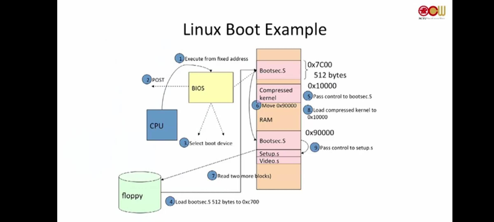
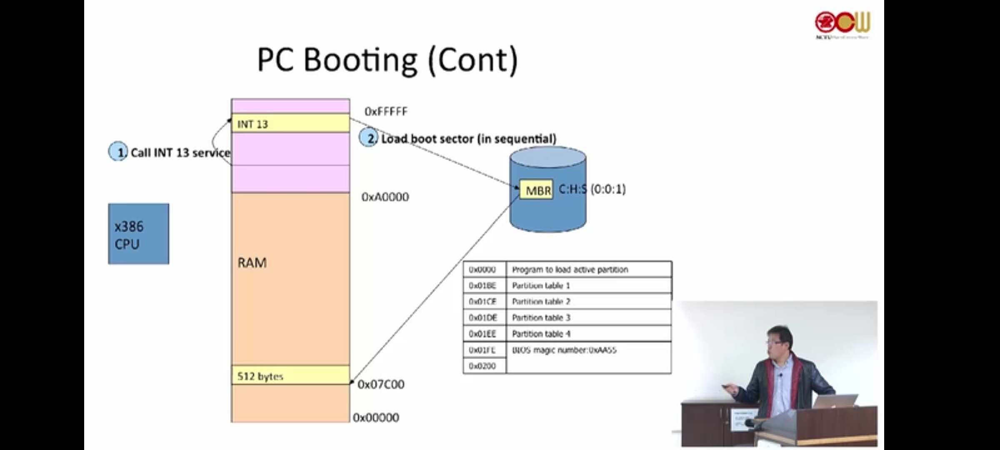
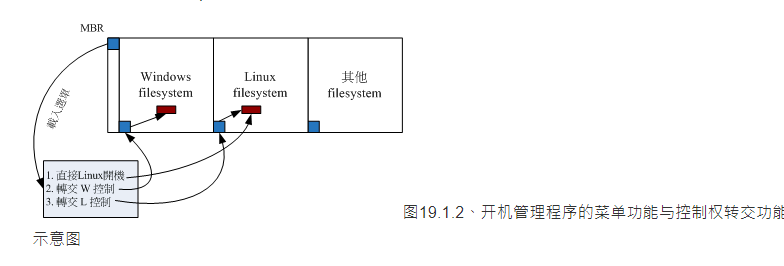
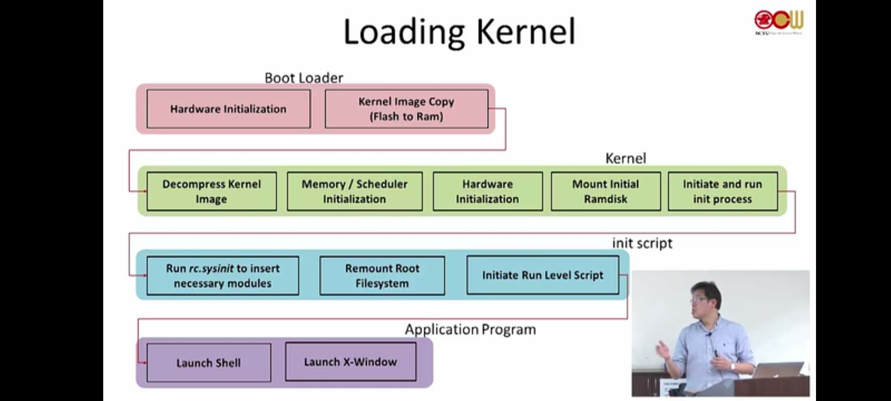
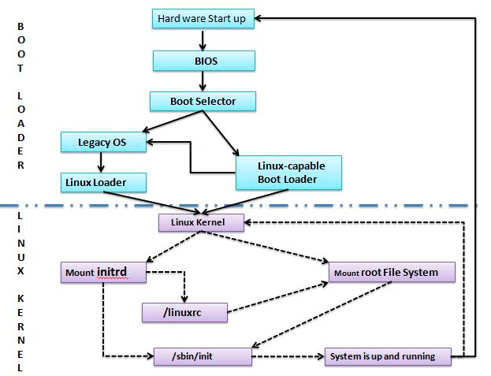

---

layout:     post
title:      计算机启动流程
subtitle:   从bios到操作系统
date:       2020-05-23
author:     BY beta
header-img: img/2020-05-23/head.jpg
catalog:    true
tags:
    - linux
    - 计算机启动流程
	- 操作系统
---

## 四个不同层次的加载

不同层次的加载所面临的基础条件不同，所要解决的问题也是不同的。

- first loader（永久性内存ROM等存储的bios）
  - 处理器没有任何资料，所以其所在的位置需要固定
  - 检查、初始化硬件
- second loader（存储在外部设备，硬盘、软盘）
  - 第一个loader可以访问的位置。需要规定的格式和规定的位置
  - 由第三方提供
  - 提供shell，可选择不同的操作系统
- third loader （OS loader）
  - 初始化并准备OS服务
- fourth loader（普通的程序加载）
  - OS已经准备完毕

开机流程示意图

开机流程示意简图

说明，逻辑上需要这四个步骤，而在物理上，可以将两个以上做在一起。

```flow
st=>start: power on
op1=>operation: 1. Booting from permanent memory
op2=>operation: 2. Booting from ang devices
op3=>operation: 3. Loading OS
op4=>operation: 4. Loading processes
e=>end
st->op1->op2->op3->op4->e
```
内存层次上的开机启动




## 1.first loader

bootloader 存储于永久内存，如ROM只读存储 等，开发者写在硬件中。第一个加载会从绝对位置读取，因此bios必须写在固定位置

**通常意义上的bios（仅限于x86的叫法）启动**，其主要工作：

- 硬件检查，出错误则蜂鸣

- 基本服务，如 int 13

- 提供简单的shell，如开机蓝屏的bios选项

- 加载/jump 第二个loader（基于配置文件）[通过int13读取MBR内容]

  
  
  过程的步骤比较多。如果能看到信息，那说明fist loader是成功结束了。
  
  被bios找到的引导扇区会被加载到内存的0x7c00
  
  

内存地址与外设的对应关系 { A0000-FFFFF区域}

MBR会被加载到0x7c00 见上图。512字节。


## 2. second loader

bootloader存储于DISK、CD-ROM、闪存、软盘等。

通常意义上的GRUB

- 第一个加载器可以访问第二个load，并将其加载到内存，给予运行权限

- 必须以正确的格式放在正确的位置，放在第一个扇区（MBR），并且最后两字节为0x55和0xAA

- 必须知道如何加载OS

- 会提供shell给用户以选择OS（比如windows、centos、ubuntu等）

- 将OS加载到内存

由于MBR只有512个字节，GRUB无法完整的放在MBR中，因此GRUB会分为两个阶段：

- 阶段一：通常是汇编，保存在MBR	

  1. 屏蔽所有的中断
  2. 关闭处理器内部指令/数据cache
  3. 为第二阶段准备空间
  4. 拷贝stage2到内存
  5. 设置堆栈
  6. 跳转到stage2

- 阶段二：C编写，保存在/boot/grub/

  1. 初始化硬件
  2. 检测内存映射
  3. 将kernel从硬盘读取到内存
  4. 为内核设置启动参数
  5. 调用内核

  每个操作系统在安装到固定的磁盘，都会默认将本系统的boot loader安装到该磁盘的boot sector（开机扇区）。另一方面对MBR而言，linux安装时，可以选择将boot loader是否安装到MBR，  而windows会默认将boot loader安装到开机扇区和MBR。

  GRUB能够调用不同的操作系统，是由于其具有控制权转移的功能，而windows的loader默认不具有这个功能，因此安装windows 之后不能选择操作系统。




## 3. third loader

  OS loader，加载操作系统



kernel的一些启动额



## 4. fourth loader

  实质上是指加载各类程序