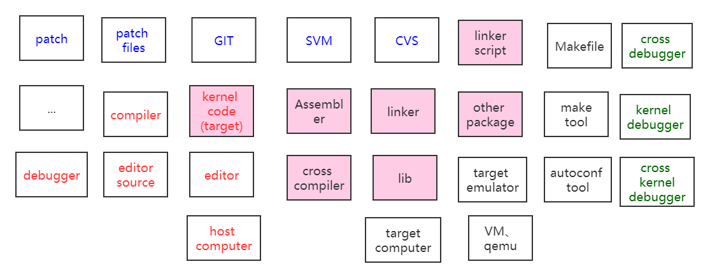

---

layout:     post
title:      开发操作系统所需组件
subtitle:   在host主机上开发符合target主机架构的操作系统
date:       2020-05-25
author:     BY beta
header-img: img/2020-05-25/head.png
catalog:    true
tags:

    - 内核开发
    - 计算机操作系统
        
---

## 开发操作系统组件

开发target kernel，实质上是在 本机上 编写符合 目标主机架构 的kernel代码，并编译、调试。

### 1. 编写kernel所需工具

1. 要开发目标系统的kernel，需要一个开发环境。一开始需要editor编辑代码，editor运行在计算机上，所以还需要一个工作平台（host computer）

2. 要得到editor，通常需要editor source，然后使用后host computer 的compiler编译editor，得到二进制文件。编译的文件不一定可以正常运行，所以需要host computer上的debugger进行调试。

3. 总结**编写**目标系统kernel所需的组件：host machine，editor source，editor，本机的compiler，本机的debugger

### 2.编译kernel所需工具

1. 通过cross compiler 编译kernel code，跨平台编译器虽然运行在本机上，却是为了不同架构的目标主机生成kernel。
2. 对于源代码而言，需要编译（cross compiler）生成汇编语言，再通过汇编（assembler）生成机器语言，最后通过链接(linker)生成目标主机的kernel。linker是将不同的function连接起来，用户模式下的程序和kernel都会需要一些lib（user lib 和 kernel lib），避免重复劳动。编译较大文件，需要借助linker script，脚本可以帮助批处理。
3. 当编译程序较大时，会借助Makefile编译，手写Makefile容易出错，所以有需要make tool。
4. target computer具有不同的硬件架构，为了调试的方便，通常会采用虚拟的硬件，因此需要虚拟仿真器，如VM，qemu，virtualbox等。在选定硬件之后，使用target emulator摸拟硬件。
5. 如果需要跨平台，autoconf tool可以帮助不同的架构选择合适的lib

### 3.调试kernel所需根据

1. cross debugger 调试目标主机的用户程序

2. kernel debugger 调试target kernel。借助qemu 和 gdb 可以调试kernel，qemu可以虚拟出指定的硬件底层。

3. cross kernel debugger在本机上调试另一个底层的kernel，需要跨平台。

### 4. 版本管理

1. patch 记录前后两个文件的不同
2. GIT、SVN、 CVS帮助多人开发



## 裸机上运行os kernel

### 1.制作软盘

```
dd if=/dev/fd0 of=boot.img bs=512 count=2880
查看
file boot.img
是数据文件
```


### 2.引导代码写入软盘

``` 
dd if=boot.img of=boot.img count=1 conv=notrunc
查看
file boot.img
x86 boot sector

```


### 3. 运行模拟器，从软盘启动

```
qemu boot.img
```

