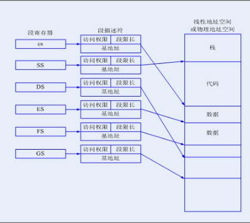

---
layout:	post
title:	实模式与保护模式下的寻址
subtitle:分段分页机制的介绍
date:	2020-06-20
author:	BY beta
header-img:img/2020-06-21
catalog:	true
tags:
	-	操作系统
	-	内存管理
---


## 前言

此篇博客主要是为了理解实模式和保护模式，分段与分页等概念的区别。

首先得非常明确的指出：

1. 实模式有分段寻址：物理地址=段基址+段偏移。

2. 保护模式有两种寻址方式，涉及到三种地址：逻辑地址、线性地址、物理地址。

   1.  分段模式。物理地址=段选择符+段偏移；段选择符需要在GDT或LDT中找到段基地址，

   2. 分段页模式。核心是逻辑地址->线性地址->物理地址；分段实现了逻辑地址到线性地址的转换，分页实现了线性地址到物理地址的转换。

      线性地址=段选择符+段偏移；

      物理地址= F（线性地址）；
   
3. 分段和分页都是为了更好的管理内存，效率、安全等方面

4. linux基本不使用分段的机制。也就是说，分段或分页机制作为一种内存管理的方式，却不是必须的或唯一的内存管理方式。

## 1.基础概念

### 1.1 何为模式

无论是实模式还是保护模式都是CPU的工作模式，而CPU的工作模式是指**CPU的寻址方式、寄存器大小等反应CPU在环境下如何工作的概念**。

CPU模式除了常见的实模式、保护模式还有长模式、系统管理模式等。

### 1.2 实模式与保护模式的来历

由上一节我们知道，各模式的区别在于CPU的寻址方式等不同。而CPU寻址方式的不同是由于计算机技术的发展，CPU内部的基础构件不同。

- 在早期8086CPU，数据总线为16位，地址总线为20位，寄存器为16位。
- 而从80386开始，数据总线和地址总线位32位，寄存器也是32位。

而计算机为了**向前兼容**（兼容是计算机非常重要的特性）都保留了实模式，现代操作系统在刚加电首先运行在实模式下，然后切换到保护模式。

## 2. 实模式Real mode

对于计算机而言，指令和数据都是存放于内存中，cpu工作需要将存放于内存中的指令取出。而取出数据就需要CPU在内存中找到正确的存放位置。

### 实模式寻址与分段

实模式下的地址总线为20位，也就是说，实模式所能寻址的空间是2^20=1MB。

但是cpu的寄存器只有16位，如何表示20位的地址？此时为了访问某个内存地址，采用如下格式来表示：

​		地址 = 段基址：段偏移量

- 其中第一个字段是段基址，它的值是由**段寄存器**提供的(一般来说，段寄存器有6种，分别为cs，ds，ss，es，fs，gs，这几种段寄存器都有自己的特殊意义，这里不做介绍)。
- 第二字段是段内偏移量，代表你要访问的这个内存地址距离这个段基址的偏移。它的值就是由通用寄存器来提供的，所以也是16位。那么两个16位的值如何组合成一个20位的地址呢？CPU采用的方式是把段寄存器所提供的段基址先向左移4位。这样就变成了一个20位的值，然后再与段偏移量相加。

即：

　　物理地址 = 段基址<<4 + 段内偏移

　　所以假设段寄存器中的值是0xff00，段偏移量为0x0110。则这个地址对应的真实物理地址是 0xff00<<4 + 0x0110 = 0xff110。

由上面的介绍可见，实模式的"实"更多地体现在其地址是真实的物理地址。

## 3. 三类地址

为了在下文叙述方便，先将计算机中的三类地址概念：

- 逻辑地址：即逻辑上的地址，实模式下由“段基地址+段内偏移”组成；保护模式下由“段选择符+段内偏移”组成。

- 线性地址：逻辑地址经分段机制后就成了线性地址，它是平坦的；如果不启用分页，那么次线性地址即物理地址。

- 物理地址：线性地址经分页转换就成了物理地址。

注意到这里的模式地址在不同模式下是不同的，实模式是段基地址，保护模式是段选择符。很重要，下文会讲。

## 4. 保护模式 Protected mode

###　4.1 保护模式起源

​		一方面，在上节保护模式的介绍中，我们知道保护模式下的程序寻址是　段基址：段内偏移　的方式。这样的好处是程序员指定的地址就是在内存中的物理地址，物理地址是对程序员可见的。但是也有致命的问题：

```
	在实模式中整个物理内存被看成分段的区域，程序代码和数据位于不同区域，系统程序和用户程序没有区别对待，而且每一个指针都是指向「实在」的物理地址。这样一来，用户程序的一个指针如果指向了系统程序区域或其他用户程序区域，并改变了值，容易造成软件甚至系统崩溃。
```

​		另一方面，随着计算机技术的发展，CPU 的地址线的个数也从原来的 20 根变为现在的 32 根，所以可以访问的内存空间也从 1 MB 变为现在 4 GB，寄存器的位数也变为 32 位。因此，实模式下的内存地址计算方式就已经不再适用了，需要引入新的模式，即保护模式，实现**更大空间的、更灵活同时也更安全的**内存访问。


### 4.2 全局描述符（段描述符表）

由于之前讲到了实模式寻址方式不安全，各个数据段没有做权限的区分和访问控制，因此在保护模式下需要加一些限制（限制的实现都是通过某些位的0或1决定），但这些限制不是寄存器可以容纳的，因此引入了新的数据结构--全局描述符GDT。


全局描述符含有一个个表项，每一个表项称为**段描述符** ，一个段描述符位8字节（64bit）。而段描述符存放了段基址、段界限、内存段类型属性(比如是数据段还是代码段,注意**一个段描述符只能用来定义一个内存段**)等许多属性,具体信息见下图。


从图中可知，段选择符指向的段描述符里有三个部分基地址信息，这三部分组成一个32位地址就决定了段基地址位置，此地址再加上段内偏移最终确定线性地址位置。

  段描述符中的S位和TYPE字段（四位）的不同又分为数据段描述符、代码段描述符（S=1）和系统段描述符(S=1)。

- 当S=1，数据段和代码段描述符类型如下图所示。


当S=0，系统段描述符 类型如下。


### 4.3 分段寻址

在保护模式下的寻址方式可以分为两类，分段寻址和 分段页寻址。本节描述分段寻址。以下的所有描述是IA32架构。

在三类地址小节中提到，保护模式下的是通过 “段选择符+段内偏移”寻址到线性地址。如下所示。

注：如果不启动分页机制，那么此线性地址就是最终的物理地址。


段选择符位16位，指向全局描述符（段描述符表）中的某个段。这里可以想到，段选择符其实也是一种偏移，那么CPU必须指定一个全局描述符的地址。在现代CPU中，这个专门的寄存器就是GDTR（48位寄存器），专门存放GDT的内存地址及大小。

#### 段选择符（段选择子）

段选择符结构如下，其中T1表明指向全局描述符表GDT还是局部描述符表LDT，RPL表示请求特权级。这里可以看出保护模式下全局描述符最多有2^13=8192个段描述符，同时每个局部描述符最多也有2^13段描述符，因此最多有8192*2


因为TI可以指向GDT和LDT，而两种方式的寻址略有差异，遂分开描述：

##### a. TI指向GDT

当TI=0时表示段描述符在GDT中，如下所示。寻址步骤为：

1. 先从GDTR寄存器获得GDT基址
2. 然后从GDT基址开始，加上段选择符高13位的索引值得到段描述符。
3. 从段描述符中获得段的基址+段内偏移得到线性地址。


##### b.TI指向LDT

当TI=1时表示段描述符在LDT中，如下图所示：
①还是先从GDTR寄存器中获得GDT基址。
②从LDTR寄存器中获取LDT所在段的位置索引(LDTR高13位)。
③以这个位置索引在GDT中得到LDT段描述符从而得到LDT段基址。
④用段选择器高13位位置索引值从LDT段中得到段描述符。
⑤段描述符符包含段的基址、限长、优先级等各种属性，这就得到了段的起始地址（基址），再以基址加上偏移地址yyyyyyyy才得到最后的线性地址


##### c. GDT和LDT区别

GDT只是一个段描述符类型的数组，它主要是用于内存寻找。为了对部分内存区域（存放着核心数据）进行保护，因此将段描述符设计成了三部份。而LDT的结构和GDT类似，我们可以这样理解GDT和LDT：GDT为一级描述符表，LDT为二级描述符表。

- GDT中包含的段描述符X和LDT中包含的私有段描述符Y，所占空间相同。
- GDT中包含的段描述符X和GDT中包含的LDT描述符，所占用空间相同。
- LDT不包含在GDT中。GDT中只是包含了LDT描述符（一个指向LDT起始地址的指针）。

### 4.4 分段页寻址

在分段页寻址模式下，首先通过分段机制将逻辑地址转换为线性地址，在通过分页机制将线性地址转换为物理地址。

以32位操作系统为例，每个线性地址由32bit构成，划分成三个区域，分别是10bits的页目录索引，10bits的页表索引，和12bit的页内偏移地址。

在虚拟内存映射到物理内存的过程中：

1. 先通过读取页目录索引（其实也可以理解为偏移，因为CPU中的控制寄存器CR3是页目录基地址寄存器）和CR3得到页表基地址；

2. 页表基地址+页表索引，得到内存页的首地址；

3. 内存页的首地址+页内偏移地址，得到最后的物理地址。

   这里也可以看到，页大小是由操作系统所决定，32位操作系统的页是4k


将分段和分页结合在一起，那么保护模式下完整的分段页寻址就如下图所示：


### 4.5 寻址方式的硬件实现MMU

在保护模式下，逻辑地址到物理地址的转换时通过内存管理单元实现（MMU）。MMU由一个或一组芯片组成，其功能是把逻辑地址映射为物理地址，即进行地址转换，如图所示。


MMU是一种硬件电路，它包含两个部件，一个是分段部件，一个是分页部件，在此，我们把它们分别叫做分段机制和分页机制，以利于从逻辑的角度来理解硬件的实现机制。分段机制把一个逻辑地址转换为线性地址；接着，分页机制把一个线性地址转换为物理地址。如下：


## 5. 分段和分页的意义

#### 1.实模式下的分段机制

- 为了解决16位寄存器和20位地址总线的转化

####　２.保护模式的分段机制

- 借助段描述符实现了对代码段,数据段,系统段的保护
- 段可以程序私有，也可以公有。实现了段共享。

####　３.保护模式的分页机制

- 分段机制下，每次加载整个段，非常占用内存空间。切换程序如果导致内存和磁盘的读取、存储，会消耗大量时间。分页机制采用粒度更小的页，这样可以保证更加灵活、高效的使用内存。


一个多段模型充分发挥了段机制的对代码、数据结构和程序提供硬件保护的能力。每个程序都有自己的段描述符表和自己的段。段可以完全属于程序私有也可以和其它程序之间共享。

访问权限的检查不仅仅用来保护地址越界，也可以保护某一特定段不允许操作。例如代码段是只读段，硬件可以阻击向代码段进行写操作。





##　6. linux下的分段和分页

那么多关于分段机制的实现，其实，对于Linux来说，并没有什么卵用。因为，Linux基本不使用分段的机制，或者说，Linux中的分段机制只是为了兼容IA32的硬件而设计的.

Intel微处理器的段机制是从8086开始提出的， 那时引入的段机制解决了从CPU内部16位地址到20位实地址的转换。为了保持这种兼容性，386仍然使用段机制，但比以前复杂得多。因此，Linux内核的设计并没有全部采用Intel所提供的段方案，仅仅有限度地使用了一下分段机制。这不仅简化了Linux内核的设计，而且为把Linux移植到其他平台创造了条件，因为很多RISC处理器并不支持段机制。但是，对段机制相关知识的了解是进入Linux内核的必经之路。

又是很复杂的内容呀,高速缓存,大页存储...


## 参考文章

1. 实模式和保护模式区别及寻址方式。https://www.cnblogs.com/bethunebtj/articles/4839781.html

2. CPU的实模式和保护模式(一)。https://zhuanlan.zhihu.com/p/42309472

3. 关于GDT和LDT的理解。https://blog.csdn.net/weixin_40909092/article/details/103794189
4. linux内存寻址。https://cloud.tencent.com/developer/article/1172683