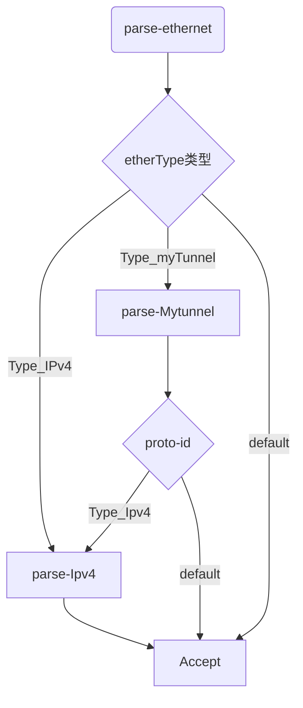

```
layout:     post
title:      P4 basic_tunnel 实现
subtitle:   P4官方教程（二）
date:       2020-10-19
author:     BY beta
header-img: img/2020-10-19/head.png
catalog:    true
tags:
    - 工程
    - P4

```

## 1. 实验basic_tunnel目的

本实验是为了实现数据包根据自定义的隧道协议实现转发，若数据包不存在隧道头，则根据IP转发（实验一实现）.

显然为了实现隧道协议，需要定义一个新的报头类型，并修改交换机处理逻辑。

## 2. 实验准备

本文使用的环境

## 3. 实验过程

### (1). 实验逻辑

在这个实验中， 只需要修改basic_tunnel.p4代码。basic_tunnel.p4经过编译器（p4c-ss-bmv2)生成basic_tunnel.json配置文件。之后运行脚本会将json文件导入到交换机，实现交换机的处理逻辑。

而交换机具体的流表规则，已经由示例给出，无需修改。

### (2).实验步骤

#### parse过程

parse负责将数据包报头的各个部分提取，为之后的处理流程做准备。

basic_tunnel的解析流程如下图所示，首先解析etherType类型，并根据相应的类型，选择不同的解析过程。



代码如下：

```
parser MyParser(packet_in packet,
                out headers hdr,
                inout metadata meta,
                inout standard_metadata_t standard_metadata) {

    state start {
        transition parse_ethernet;
    }

    state parse_ethernet {
        packet.extract(hdr.ethernet);
        transition select(hdr.ethernet.etherType) {
            TYPE_IPV4 : parse_ipv4;
            TYPE_MYTUNNEL : parse_myTunnel;
            default : accept;
        }
    }

    state parse_ipv4 {
        packet.extract(hdr.ipv4);
        transition accept;
    }
    state parse_myTunnel{
        packet.extract(hdr.myTunnel);
        transition select(hdr.myTunnel.proto_id) {
            TYPE_IPV4 : parse_ipv4;
            default : accept;
        }
    }
}
```


#### Ingress 过程

经过解析之后，就到了Ingress部分。

ingress从下往上分为三个部分：action，table，control flow。若干个组成一个table，若干个table组成一个control flow。所以思考顺序是control flow->table->action。而具体的实现则是，action->table->control flow。

在这部分中，首先定义一个action，`myTunnel_forward`修改数据包流出交换机的端口。代码如下：

```
action myTunnel_forward(egressSpec port) {
	standard_metadata.egress_spec = port
}
```

接着，定义所需的table，myTunnel_exact精确匹配dst_id并执行相应的action。代码如下：

```
table myTunnel_exact{
	key = {
		hdr.myTunnel.dst_id: exact;
	}
	actions = {
		myTunnel_forward;
		drop
	}
	size = 1024;
	default_action = drop();
}
```

最后，实现控制逻辑apply。在本实验中，如果存在隧道协议，则根据隧道协议转发，否则根据IP头转发。代码如下：

```
apply {
	if(hdr.myTunnel.isValid()){
		myTunnel_exact.apply();
	} else if(hdr.ipv4.isValid()) {
		ipv4_lpm.apply();
	}
}
```

#### deparse 过程

此过程主要是更新数据包头。代码如下

```
control MyDeparser(packet_out packet, in headers hdr) {
	apply {
		packet.emit(hdr.ethernet);
		packet.emit(hdr.myTunnel);
		packet.emit(hdr.ipv4);
	}
}
```

## 4.实验结果


1. 启动运行，在basic_tunnel目录下`~/P4/tutorials/exercises/basic_tunnel`输入

   ```
   make run
   ```

   - 编译basic_tunnel.p4

   - 启动MIninet，并生成如下拓扑

     

2. 运行成功则进入Mininet命令行，为三个交换机都启动终端：

   ``` 
   mininet> xterm h1 h2 h3
   ```

   将交换机h2和h3作为接收端：

   ```
   h2> ./receive.py
   h3> ./receive.py
   ```

   

3. 打开wireshark，监视s1-eth1端口

### 测试IP转发

1. 在h1终端中输入

   ``` p4
   ./send.py 10.0.2.2 " h1 send to h2 by IP protocol 
   ```

   在h2的终端可以看到接收到的数据包

   

   同时，我们在wireshark可以看到h1 和h2 的数据包通信

   

2. 

### 测试隧道转发

这个步骤相对有意思一些。我们可以尝试使用一致的IP和隧道，也可以尝试当IP和隧道不一致时，交换机会按照哪种逻辑进行。

1. IP和隧道一致

   从上面的网络拓扑中可以看到h2的ip地址为10.0.2.2，隧道协议标识为2。所以我们在h1的命令行中输入

   ```
   ./send.py 10.0.2.2 "h1 send to h2 by tunnel protocol" --dst_id 2
   ```

   在h2的终端可以看到成功接收到数据包

   

   同时打开wireshark，可以看到其传输协议为0x1212(本实验设定的隧道协议)，采用广播的方式进行传输

   

2. IP和隧道不一致

如果IP和隧道不一致，按照本实验的逻辑，应该是按照隧道协议进行传输。接下来我们进行验证。

在h1的终端中输入

```
./send.py 10.0.2.2 "h1 send to h3 by tunnel protocol" --dst_id 3
```

结果如我们所料，尽管IP地址指向了h2，但是tunnel协议的优先级更高。在h3我们接收到了相应的数据包，并且其包头的dst还是10.0.2.2. :P


## 5.实验总结

总体来说，本实验没有太大的难度。目的是为了提高对P4处理逻辑的认识和熟练度。