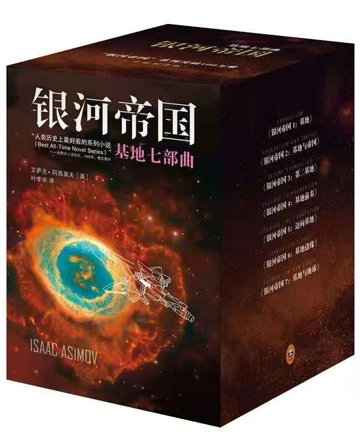

>他们的青春已堵住了我
>
>他们的身影已变成了我
>
>哦请你变老 就快点变老
>
>然后把我找到

# 前言

美国大选结束，拜登赢得了选举，也展示了美国社会割裂的现状。

饶毅发文声称无法复现裴钢的学术成果，结果让人感慨。

华为步履维艰，却依旧挺立在风雨之中。

可能是因为20年的疫情让大家的生活都变得和以前不一样，而我们需要很多的时间去适应疫情下的生活。疫情让我直到五月份才去学校，在家整整呆了五个月；在家的时候生活很放松，每天上个网课，和同事一起写一些调试手册。因为爸妈都不在家，所以在家给自己做饭是一个挺麻烦的事情。对自己而言，需要花费很长的时间在饮食上，为了方便和营养，每周自己都会炖鸡，这样可以连续吃两到三天而不需要再想吃什么，再者，鸡肉的营养也比较高。说起来，可能还是会有些遗憾，因为在家的那段时间实在是太宝贵了。但是也不必太感慨，毕竟自己也是第一次独立的生活，自然也是需要时间去适应新的角色与生活方式，在这个调整的过程中，难免出现心理上的懒散和生活上的放松。都应该很好的去正视这个问题，接受它是自己的一部分，看到不足，寻求解决方案。

也让我进入学校之后就处于封闭式管理，直到寒假。因为疫情，今年学校的管理非常的严格，几乎没有给我们外出的机会。好在今年对我来说学业上的事务很多，也没有很大的心思跑出去玩。想想挺有意思的，本科的时候自己超喜欢看电影，硕士的时候又很喜欢读书。到现在这个阶段，则是六根清净，只想看论文、写论文。让人感慨的是，在这个学校已经第五年了，再看到那些新来的同学，看到他们充满活力的样子和对事物好奇的心态，还是挺让人唏嘘的。可能很多时候觉得自己没有心境去做各种各样的事情是因为学校的基础设施没跟上，但是对于年轻的新生来说，生活是他们自己创造出来的，即使是不那么宽松丰富的环境，他们也能让自己的生活丰富多彩。

几周以前，送走了一个师兄。从我入学那一年，师兄就在了。我们也算是在一个学校呆了整整五年，那天送师兄走的时候，一起吃了个早饭。一边吃，一边就想，我和师兄也算是很有缘分了，能够在一个部门呆五年，不过回想起来，也不过是一起吃了三四次饭罢了。人与人之间的缘分，真的很不容易。我的直系师弟，我们两在一起共事两年半了，也没有机会单独吃个饭聊聊天呢。缘分不过是一起做一些事情，想来觉得单薄的很，三四次饭、五六次交谈而已。即使是有缘成为男女朋友，一起走的路也是屈指可数。

经过去年年尾的争执，今年年初的时候还是和L分手了。不得不说，我经历了一段非常痛苦的日子。因为在这段感情里，自己是真心诚意的付出了很多，也一直希望会有一个很美好的结局。但是，人生总是会有这样、那样的事情。或者时间不到、或者相处不合，不必怨天尤人感慨万千。

自己的心态发生了很大的变化，也可以说是博士生活与之前的经历有很大的不同。而这种生活重心的不同促使我不得不去适应，适应每天的心理压力、自驱动的长时间工作。尽管我认为每天呆在实验室的时间过长不利于科研的进展和个人的心理健康。可是，当生活安排全部围绕着论文的时候，我无法做到安心的呆在宿舍闲适。也许这有点像"异化"，我的价值全部被论文所决定，时间、精力。即使是停留下来，我也找不到其他生活的倾向。

可能每个读博的人，内心都会经历这种心无旁骛、专心致志的时候。不可否认，会给人很大的压力。我的室友也曾在今年有过长达一个月的郁闷期，闷闷不乐，成天思考人生的意义。哎，也幸好还有室友。在这条路上可以一起分担同行。

有人说读博等于赌博。现在我的心里非常认可这句话，国家的政策、行业的发展、社会的形势变化太快了，很无奈也不得不去接受。对我来说，无论将来的方向在哪里，目前在学校的时间还是要好好的把所有的精力都放在学业上面，争取可以做一些有用的东西出来。加油！

# 旅游

今年因为疫情，去的地方很少。能够抽时间，同时自己也有兴致参与的，大概就是去华山。华山有一张非常有名的照片，花岗岩山顶，一面是如刀削出来的近乎90度的垂直面。这次亲自登华山，光是这个上山的缆车就把我吓得够呛。之前的缆车大抵是垂直高度差大，但是水平距离不远，而华山的缆车水平距离很远，因此有一段缆车是需要先下后上，类似于N。缆车在两山之间运行，过山风很大吹的缆车水平晃，让我心惊胆战。到达商定后，有一段路很像是鱼背，往上走时还未意识到整体的美感，只觉得一面的风景很开阔。带到回头看的时候，才发觉就是之前哪个著名的华山莲花峰。

华山地理位置确实太好了，卡在入关中的路口，古往今来来来往往多少人都绕不过这个险峻、壮美的名山。站在华山，一面是连绵不绝的秦岭，另一边则是开阔的关中平原，美哉！

# 读书

今年的阅读量也很少。说起来，自己确实打算下功夫提高阅读量，但是每天在论文上消耗的时间、精力有些大，再者，我从内心中也不敢把时间懈怠。完整读完的大概就是《围城》《白鹿原》《驻京办主任》，《银河帝国》只读了第一部。

《白鹿原》算是较容易阅读的小说，单向度，理解起来不难，语言平实。遗憾的是，作者在处理整个故事的逻辑上有所欠缺，没能给故事提供足够的细节信息。因此读完一遍，是没有兴趣再读的。

《银河帝国》是阿西莫夫非常有名的作品。读这本书有个很重要的契机是当时自己在实验室坐的太久，便去书架那边走了走，无意中看到这本书便拿起来看了看，结果是爱不释手呀。故事的设定以及心理史学的概念编是让人耳目一新。

# 健身

今年在健身上面花费的时间足够的多。从五月份回学校以后，基本上养成了去操场或者健身房运动的习惯。同时也是发动自己的室友和我一起锻炼。工作日的下午五点准时离开实验室去锻炼大约30-40分钟，给自己的生活增添了许多乐趣。同时也是非常好的放松方式，运动完回宿舍洗个澡，实在是太惬意啦。

除了规律以外，对于饮食上，我也有了很大的改变。起初是因为终南山院士讲到提倡中国人早饭吃牛奶，那时起，自己便改掉了早饭喝粥的习惯，之后更是加强营养的补充。早上保证两到三个鸡蛋，下午锻炼完吃一瓶牛奶，如果晚上又有一些运动，或饥饿，则再喝一瓶牛奶。

饮食和运动对我的身体有非常大的改变，整体来说，自己现在的身体状态很好，精力充沛，体力也有了很大的提升，整个人的状态也很积极。运动的习惯一定要坚持下去，每个人都应该像运动员一样拥有强健的体魄。

# 吉他

今年在吉他上的进步是很大的，这种进步主要表现在作品数量上。其实吉他的技巧自己并没有很大的提高，还是之前就会的一些，现在自己将它们与具体的曲目联系在一起。在B站上发表了一些作品，想给自己一些及时的反馈吧，这样可以更有意愿、动力。

值得一提的是，国庆的晚会上，自己也是鼓起了勇气上台给大家弹唱了一首。非常高兴，自己可以挑战自己，突破自身的局限，让自己经历了从未经历的事情。那种感觉真的很棒。谢谢那么有勇气的自己。

# 博客

今年是自己开始真正意义上搭建个人博客的开始。写的内容数量不少，深度相对欠缺一些。我还是需要花费更多的时间好好思考问题，寻求自己的理解。

希望明年可以输出高质量的文章。

# 尾声

21年对我来说是非常有挑战性的一年，因为这一年我需要完成各种小论文，思考大论文。同时项目上的事情也会很多，很繁琐。心理上会有很大的压力，时间上很紧张。希望自己可以好好的应对这些挑战。对于21年，我也有自己的希望：

1. 好好完成学业上的工作
2. 输出一些高质量的思考文章
3. 坚持锻炼身体，乐观积极

> 星星和月亮一起闪耀
>
> 驱散了孤独和寂寥
>
> 洒向黑暗的每一秒
>
> 也会把你照耀

